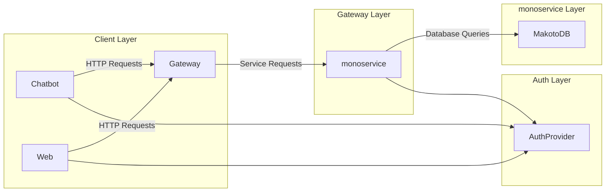
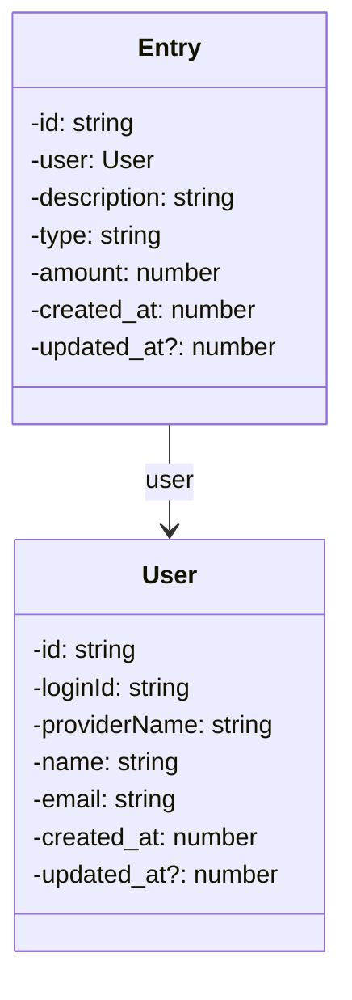

# Makoto 
#### under construction

Makoto is an API layer where you can track financial expenses and gains, currently, people use spreadsheets that could create a mess depending on the case, the aspiration is to generate a friend agent where you can chat like your personal accountant to generate your financial reports.

## HLD

### Architecture



### Domain



## Third Party

### Auth0

Response example:

```json
{
	"sub": "auth0|646faaaeb087f578dcc892cd",
	"nickname": "johnny",
	"name": "johnny@cash.com",
	"picture": "https://s.gravatar.com/avatar/1b9582628abe919dc33220a979d0a696?s=480&r=pg&d=https%3A%2F%2Fcdn.auth0.com%2Favatars%2Fcr.png",
	"updated_at": "2023-05-25T18:13:32.479Z"
}
```

## Tests

### new user

```
curl -i -X POST 'http://localhost:3010'/users -H "Content-type: application/json" -d '{ "id": "1", "name": "John Doe", "loginId": "johndoe123", "provider": "Google", "email": "johndoe@example.com", "password": "password123", "created_at": 1646307758, "updated_at": 1646307786 }'
```

### new entry

```
curl -i -X POST 'http://localhost:3010'/entries -H "Content-type: application/json" -d '{"user": {"id": "1"} , "description":"teste","type":"DEBIT","amount":23.55}'
```

### get entries by year and month

```
curl http://localhost:3010/entries\?year\=2023\&month\=06
```

### get all users

```
curl http://localhost:3010/users
```
