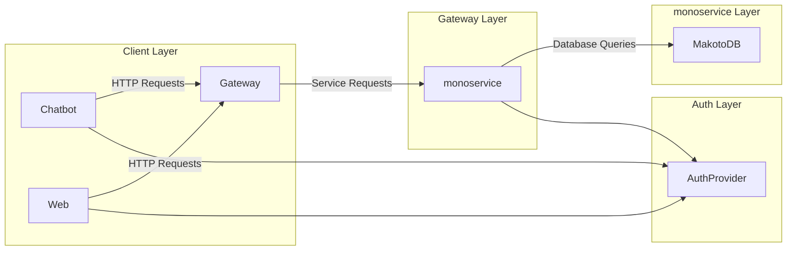
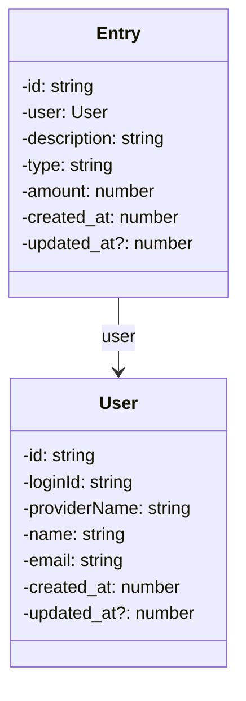

# Makoto

Makoto is API layer with a chatbot and web client where we can track financial expences, currently people uses

## HLD

### Architecture



### Domain



## Third Party

### Auth0

Response example:

```json
{
	"sub": "auth0|646faaaeb087f578dcc892cd",
	"nickname": "johnny",
	"name": "johnny@cash.com",
	"picture": "https://s.gravatar.com/avatar/1b9582628abe919dc33220a979d0a696?s=480&r=pg&d=https%3A%2F%2Fcdn.auth0.com%2Favatars%2Fcr.png",
	"updated_at": "2023-05-25T18:13:32.479Z"
}
```
